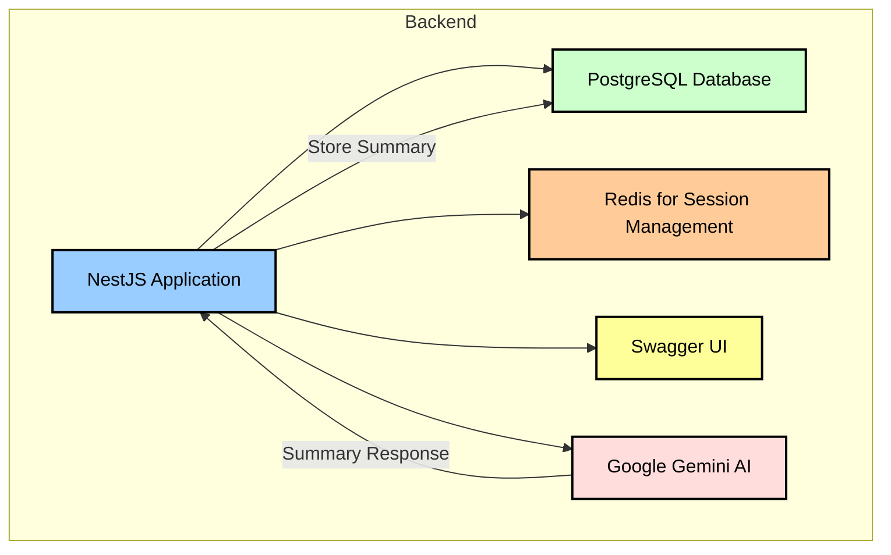
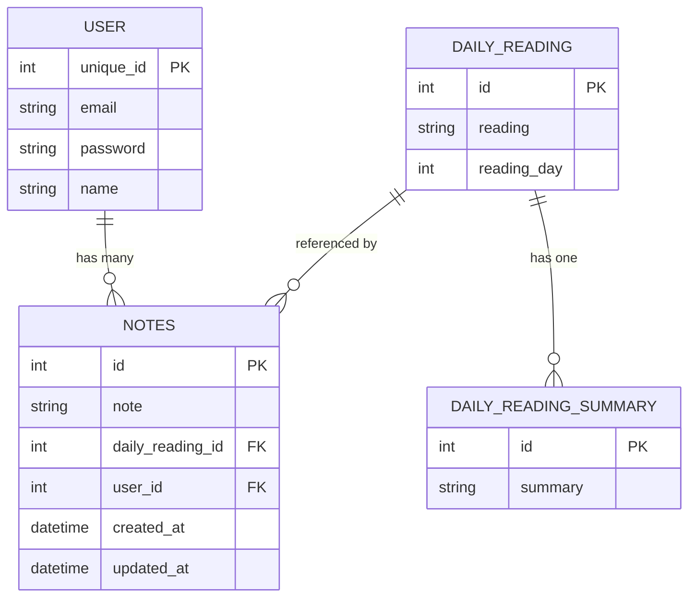

<div align="center">
  
</div>

## Overview

This is the backend for the project, built with **NestJS**. It connects to a **PostgreSQL** database, uses **Redis** for session management, integrates **Swagger** for API documentation, and sends requests to **Google Gemini AI** to generate summaries, which are then stored in the database. It supports modules for authentication, readings, summaries, and notes.

## Architecture Diagram



## Environment Variables

Create a `.env` file in the `backend` directory with the following variables:

| Variable          | Description                       | Example             |
| ----------------- | --------------------------------- | ------------------- |
| DATABASE_HOST     | Database host                     | 127.0.0.1           |
| DATABASE_PORT     | Database port                     | 5432                |
| DATABASE_USER     | Database username                 | nestuser            |
| DATABASE_PASSWORD | Database password                 | yourpassword        |
| DATABASE_NAME     | Database name                     | readings            |
| GEMINI_API_KEY    | API key for Google Generative AI  | your-api-key        |
| SESSION_SECRET    | Secret key for session management | your-session-secret |

## Running the Application

### Development

```bash
cd backend
npm install
npm run start:dev
```

### Production

```bash
cd backend
npm run build
npm run start:prod
```

## Database Migrations

Apply migrations with:

```bash
cd backend
npm run typeorm migration:run
```

## API Documentation

Once running, access API docs at:

```
http://localhost:3000/api
```

Powered by `@nestjs/swagger`.

## Testing

### Unit Tests

```bash
npm run test
```

### End-to-End Tests

```bash
npm run test:e2e
```

### Coverage

```bash
npm run test:cov
```

## Key Modules

### Auth Module

- Handles login using `passport-local`
- Manages sessions with Redis

### Reading Module

- Fetches daily readings
- Retrieves specific readings by ID

### Summary Module

- Sends content to **Google Gemini AI**
- Stores returned summaries in **PostgreSQL**

### Notes Module

- Users can add, update, and view notes

## Deployment

Before deploying:

- Use HTTPS for secure communication
- Set `cookie.secure` to `true`
- Use a cloud-hosted database (e.g., AWS RDS)

---

## Setting Up PostgreSQL Locally (Linux)

To run this project, you need a local instance of PostgreSQL.

### Step 1: Install PostgreSQL

```bash
sudo apt update
sudo apt install postgresql postgresql-contrib
```

### Step 2: Start and Enable PostgreSQL Service

```bash
sudo systemctl start postgresql
sudo systemctl enable postgresql
```

### Step 3: Switch to the PostgreSQL User

```bash
sudo -i -u postgres
```

### Step 4: Create a New Database User

You can create a user (e.g., `nestuser`) with a password:

```bash
createuser --interactive
```

When prompted:

- Enter name of role: `nestuser`
- Shall the new role be a superuser? `yes`

**Alternatively, using `psql`:**

```bash
psql
CREATE USER nestuser WITH PASSWORD 'yourpassword';
ALTER USER nestuser WITH SUPERUSER;
\q
```

### Step 5: Create the Database

```bash
createdb readings
```

You now have a database named `readings` and a user `nestuser`.

### Step 6: Update Your `.env` File

```
DATABASE_HOST=localhost
DATABASE_PORT=5432
DATABASE_USER=nestuser
DATABASE_PASSWORD=yourpassword
DATABASE_NAME=readings
```

### Step 7: Test the Connection

Run the backend:

```bash
cd backend
npm run start:dev
```

If everything is set correctly, the app should connect to PostgreSQL successfully.

> 🔒 **Tip:** For production, remove superuser privileges, enforce password auth, and configure PostgreSQL access rules securely.

## Entity-Relationship Diagram


